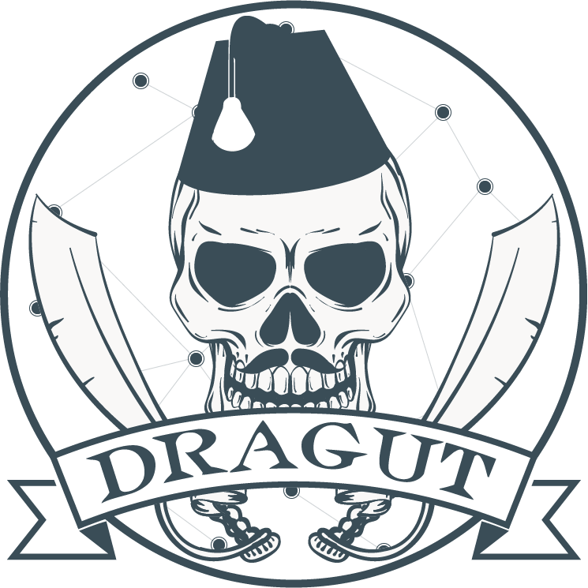

# soccerDataChallenge

  

This repository contains the code created/used by the **Dragut Team** for the [Soccer Data Challenge](https://sobigdata-soccerchallenge.it) competition organized by the [SoBigData research group](http://www.sobigdata.eu/index). The members of the Dragut team are the follows:

- [Mattia G. Campana](http://www.mattiacampana.it) (a.k.a. bytec0d3)
- [Mustafa Toprak](https://www.iit.cnr.it/node/49883) (a.k.a. Musty)
- [Kilian Ollivier](http://kilianollivier.fr) (a.k.a. Kilian MBappé)
